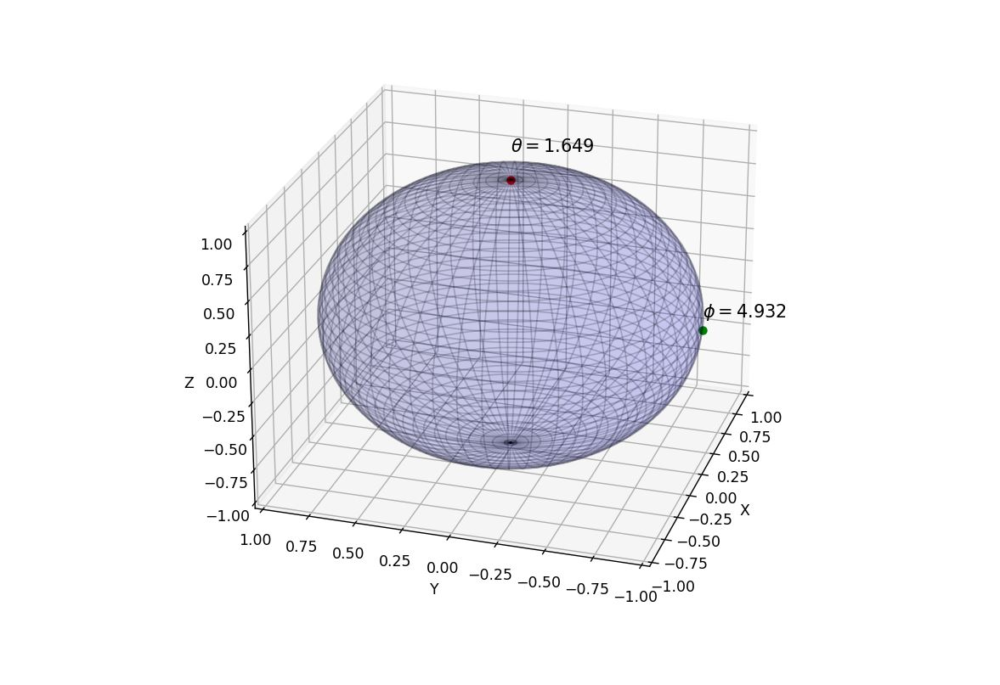

# Translation of Quantum Qubit Notations:
## Bloch Sphere Representation: 

The Bloch sphere is a geometrical representation used in quantum computing to visualize the state of a single qubit—the fundamental unit of quantum information. The state of any qubit can be represented as a point inside or on the surface of the unit sphere in a three-dimensional Cartesian coordinate system. The north and south poles of the Bloch sphere usually represent the two basis states |0⟩ and |1⟩, respectively. Any point inside the sphere represents a mixed state, while points on the surface represent pure states. The position of the point on the sphere is determined by two angles, θ and φ, which correspond to the latitude and longitude on the sphere.

Theta (θ): This is the polar angle, also known as the co-latitude or zenith angle. It is measured from the positive z-axis (the vertical axis) down to the xy-plane (the horizontal plane). The angle θ ranges from 0 to π (0 to 180 degrees). A θ of 0 corresponds to the |0⟩ state (the north pole of the Bloch sphere), a θ of π corresponds to the |1⟩ state (the south pole of the Bloch sphere), and a θ of π/2 corresponds to an equal superposition of |0⟩ and |1⟩ states (the equator of the Bloch sphere).

Phi (φ): This is the azimuthal angle, also known as the longitude. It is measured in the xy-plane, from the positive x-axis (the horizontal axis pointing to the right) around to the point of interest. The angle φ ranges from 0 to 2π (0 to 360 degrees). The φ angle determines the relative phase between the |0⟩ and |1⟩ states in the superposition.

Together, the angles θ and φ specify the position of a point on the surface of the Bloch sphere, which represents the state of the qubit. The state of the qubit is a pure state if it lies on the surface of the sphere, and a mixed state if it lies inside the sphere.

The theta (θ) value in the Bloch sphere representation of a qubit is related to the probabilities of measuring the qubit in the |0⟩ and |1⟩ states, but it's not a probability itself.

The theta value is an angle that ranges from 0 to π (or 0 to 180 degrees). It's the angle between the positive z-axis and the vector representing the qubit state.

When θ is 0, the qubit state is |0⟩, and the probability of measuring the qubit in the |0⟩ state is 1. When θ is π (or 180 degrees), the qubit state is |1⟩, and the probability of measuring the qubit in the |1⟩ state is 1.

For any other value of θ, the qubit is in a superposition of |0⟩ and |1⟩ states. The probabilities of measuring the qubit in the |0⟩ and |1⟩ states are given by the square of the absolute values of the coefficients in the superposition. These coefficients are related to θ as follows:

The coefficient of |0⟩ is cos(θ / 2)
The coefficient of |1⟩ is sin(θ / 2)
So, the probabilities of measuring the qubit in the |0⟩ and |1⟩ states are cos²(θ / 2) and sin²(θ / 2), respectively.

In summary, while the theta value itself is not a probability, it's related to the probabilities of the possible measurement outcomes for the qubit.

In the Bloch sphere representation, when the theta (θ) value is closer to 0, the qubit state is closer to |0⟩, and thus the probability of measuring the qubit in the |0⟩ state increases. Conversely, when the theta value is closer to π (approximately 3.14), the qubit state is closer to |1⟩, and thus the probability of measuring the qubit in the |1⟩ state increases.

More specifically:

When θ = 0, the qubit is in the |0⟩ state, and the probability of measuring |0⟩ is 1.
When θ = π, the qubit is in the |1⟩ state, and the probability of measuring |1⟩ is 1.
When 0 < θ < π, the qubit is in a superposition of |0⟩ and |1⟩, and the probabilities of measuring |0⟩ and |1⟩ are both between 0 and 1. The exact probabilities depend on the value of θ.

## Computational Basis Notation: 

This is another way to represent the state of a qubit or a system of qubits. In this notation, the two basis states of a qubit are represented as |0⟩ and |1⟩. For a system of multiple qubits, the basis states are represented as tensor products of the individual qubit states. For example, the basis states of a two-qubit system are |00⟩, |01⟩, |10⟩, and |11⟩. A general state of a qubit or a system of qubits can be represented as a linear combination of these basis states. For example, a general state of a two-qubit system can be represented as a|00⟩ + b|01⟩ + c|10⟩ + d|11⟩, where a, b, c, and d are complex numbers.

The computational basis notation is a way to represent the state of a quantum system, particularly a system of qubits, which are the fundamental units of quantum information.

In the computational basis, the two possible states of a single qubit are represented as |0⟩ and |1⟩. These are analogous to the states of a classical bit, which can be either 0 or 1. However, unlike classical bits, qubits can also exist in a superposition of these states.

A general state of a single qubit in the computational basis can be written as:

|ψ⟩ = α|0⟩ + β|1⟩

where α and β are complex numbers, and |α|^2 + |β|^2 = 1. The quantities |α|^2 and |β|^2 represent the probabilities of measuring the qubit in the |0⟩ and |1⟩ states, respectively.

For a system of multiple qubits, the computational basis states are represented as tensor products of the individual qubit states. For example, the basis states of a two-qubit system are |00⟩, |01⟩, |10⟩, and |11⟩. A general state of a two-qubit system can be written as:

|ψ⟩ = α|00⟩ + β|01⟩ + γ|10⟩ + δ|11⟩

where α, β, γ, and δ are complex numbers, and |α|^2 + |β|^2 + |γ|^2 + |δ|^2 = 1. The quantities |α|^2, |β|^2, |γ|^2, and |δ|^2 represent the probabilities of measuring the two-qubit system in the |00⟩, |01⟩, |10⟩, and |11⟩ states, respectively.

The computational basis notation is useful because it allows us to easily write down and manipulate the states of multiple qubits. It's also the basis in which most quantum measurements are made.

The computational basis notation is a way of representing quantum states, and the amplitudes are the coefficients that appear in this representation.

In the computational basis notation, a quantum state is expressed as a linear combination of basis states. For a single qubit, the basis states are |0⟩ and |1⟩, and a general state can be written as:

|ψ⟩ = α|0⟩ + β|1⟩

Here, α and β are the amplitudes of the |0⟩ and |1⟩ states, respectively. They are complex numbers, and their squared magnitudes give the probabilities of measuring the qubit in the |0⟩ and |1⟩ states, respectively.

So, the amplitudes are a part of the state description in the computational basis notation, but they are not the same thing as the notation itself. The computational basis notation is a way of writing down quantum states, and the amplitudes are the specific numbers that appear in this notation.

Translation of Bloch Sphere Coordinates to XYZ:
EXAMPLE: 
The values of phi (ϕ) and theta (θ) on the Bloch sphere are related to the Cartesian coordinates (X, Y, Z) as follows:

X = sin(θ) * cos(ϕ)
Y = sin(θ) * sin(ϕ)
Z = cos(θ)

In this relationship, X, Y, and Z represent the Cartesian coordinates of a point on the Bloch sphere, while theta (θ) and phi (ϕ) represent the corresponding spherical coordinates.

To convert from spherical coordinates (θ, ϕ) to Cartesian coordinates (X, Y, Z), you can use these equations. The angle θ determines the inclination or tilt of the point from the z-axis, while the angle ϕ determines the rotation of the point around the z-axis.

Conversely, if you have a point represented by Cartesian coordinates (X, Y, Z) on the Bloch sphere, you can determine the corresponding spherical coordinates using the following equations:

θ = arccos(Z)
ϕ = arctan2(Y, X)

These equations allow you to convert between the Cartesian and spherical representations of a point on the Bloch sphere.

## Execution Example: 
Bloch sphere coordinates: θ=1.649, ϕ=4.932

These are the polar and azimuthal angles that determine the state of the qubit on the Bloch sphere.

θ (theta) is the polar angle (from the positive z-axis).

ϕ (phi) is the azimuthal angle (from the positive x-axis).

State in the computational basis: |qubit⟩ = 0.6789241546800411 |0⟩ + (0.1599473037314664-0.7165743870813591j) |1⟩
This is the state of the qubit in the computational basis, which is a superposition of the |0⟩ and |1⟩ states.

Probability of measuring |0⟩: 0.46093800780800837
Probability of measuring |1⟩: 0.5390619921919915

Calculations:
The amplitude of the |0⟩ state is a real number: 0.6789241546800411.
The probability of measuring the |1⟩ state is the absolute square of its amplitude: |(0.1599473037314664-0.7165743870813591j)|^2 = 0.5390619921919915.
